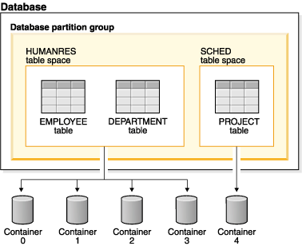

<h2>Table of Contents</h2>

<ul>
<li><a href="#sec-1">1. About Missing Link Tutorials</a></li>
<li><a href="#sec-2">2. Datomic Tutorial</a>
<ul>
<li><a href="#sec-2-1">2.1. Data Shape</a></li>
<li><a href="#sec-2-2">2.2. Map Fields</a></li>
<li><a href="#sec-2-3">2.3. Basic Schema</a></li>
<li><a href="#sec-2-4">2.4. Testdata</a></li>
<li><a href="#sec-2-5">2.5. Blow away and recreate DB</a></li>
<li><a href="#sec-2-6">2.6. Better Testdata</a></li>
</ul>
</li>
<li><a href="#sec-3">3. Query the database</a>
<ul>
<li><a href="#sec-3-1">3.1. Concept</a></li>
<li><a href="#sec-3-2">3.2. Breaking down a datomic query</a></li>
<li><a href="#sec-3-3">3.3. Datalog :where</a></li>
<li><a href="#sec-3-4">3.4. Datalog :find</a></li>
<li><a href="#sec-3-5">3.5. Pull Syntax</a></li>
</ul>
</li>
<li><a href="#sec-4">4. Parent Child Data</a>
<ul>
<li><a href="#sec-4-1">4.1. Many Refs Schema</a></li>
<li><a href="#sec-4-2">4.2. Testdata</a></li>
<li><a href="#sec-4-3">4.3. Querying Parent Child Data</a></li>
<li><a href="#sec-4-4">4.4. Parent Child Pull Syntax</a></li>
</ul>
</li>
<li><a href="#sec-5">5. Deeper Understanding</a>
<ul>
<li><a href="#sec-5-1">5.1. Fields cross SQL Table boundaries</a></li>
</ul>
</li>
</ul>

# About Missing Link Tutorials

I find a lot of technology doesn't have documentation that I can
relate to.  The style of Missing Link Tutorials is to be clear,
succint, easy, and to cover concepts and essential practical aspects
of the topic.  Without further ado&#x2026;

# Datomic Tutorial

This tutorial was written for Datomic version: 0.9.5561, which was
released on February 13, 2017. 

## Data Shape

You can think about the data that is stored in datomic as just a bunch
of maps.  Datomic doesn't have tables, like a relational database.
Records (rows) are just maps chucked into a large pile.  Datomic calls
these maps Entities.  The keys that these maps use are special, as we'll
explain later.

Below is an explicit visual sample of how you can conceive of a
datomic database:

    [{:db/id 1
      :car/make "toyota"
      :car/model "tacoma"
      :year 2014}
    
     {:db/id 2
      :car/make "BMW"
      :car/model "325xi"
      :year 2001}
    
     {:db/id 3
      :user/name "ftravers"
      :user/age 54
      :cars [{:db/id 1}
             {:db/id 2}]}]

So this datomic database has 3 entries (entities/maps/rows).  A user,
`ftravers`, who owns 2 cars.  

Every map (entity) will get a `:db/id`.  This is what uniquely
identifies that entity to datomic.  Datomic `:db/id`'s are actually
very large integers, so the data above is actually a bit fake, but I
keep it simple to communicate the concept.

As we can see in the above example, the `:cars` field (key) of the
user `ftravers` points (refers/links) to the cars he owns using the
`:db/id` field.  The `:db/id` field allows one entity to refer to
another entity, or as in this case, multiple other entities.

## Map Fields

Entities (maps) in datomic, like idiomatic clojure, use keywords for
its keys (fields).

Looking at all three records (maps/entities), in our sample database
we can see that the collective set of keys (fields) used are:

    :db/id
    :car/make
    :car/model
    :year
    :user/name
    :user/age
    :cars

Datomic doesn't allow you to just go ahead and pick any old keyword as
a field (or key) to entity maps, like you could in plain old clojure.
Rather we have to specify ahead of time which keywords entities in
datomic are allowed to use.  Defining which keys (fields) can be used
by maps (entities) is the process of creating a datomic *schema*.

In the SQL world, creating a schema means defining table names, column
names and column data types.

In datomic, we do away with the concept of a table.  You could say
datomic ONLY specifies 'columns'.  Additionally, these columns have no
relationship to (or grouping with) any other column.  Contrast this
with an RDBMS which groups columns with the concept of a table.

Here a column in SQL is equivalent to a field in datomic.  When we
specify a column in SQL we give it a name, and we indicate what it
will hold, a string, integer, etc&#x2026;  

In datomic we do the same thing, we define fields stating what their
name is and what type of data they hold.  In Datomic nomenclature
fields are referred to as **attributes**.

So this is a bit of a big deal.  In RDBMS our columns are stuck
together in a table.  In datomic we define a bunch of fields that
don't necessarily have anything to do with one another.  We can
randomly use any field we define for any record (map/entity) we want
to store!  Remember datomic is just a big pile of maps.  

Again, we can only use fields that have been predefined (the schema),
but other than that, we can create maps with any combinations of those
fields.  We'll revist this idea later on.

One more note, I've used both namespace qualified keyword fields like:
`:user/name` and non-namespace qualified keyword fields like:
`:cars`.  I do this just to show that the keywords dont need to be
namespace qualified, but it is best practice to do so.  Why you may
ask? One person suggested that they can be easier to refactor since
they are more specific.

Okay enough concepts, let's see how to define a field.

## Basic Schema

Here we create a field (define an attribute) in datomic.  We'll start
with creating just one field.  This field will *hold* an email value.

    (def schema
      [{:db/doc "A users email."
        :db/ident :user/email
        :db/valueType :db.type/string
        :db/cardinality :db.cardinality/one
        :db.install/_attribute :db.part/db}])

`:db/ident` is the name of the field.  So when we want to use this
field to store data, this is the keyword that you would use.

`:db/valueType` is the type of data that this field will hold.  Here
we use the `string` datatype to store an email string.

`:db/cardinality` can be either `one` or `many`.  Basically should
this field hold a single item or a list of items.

Those are the important fields to understand conceptually. `:db/doc`
is a documentation string, `:db.install/_attribute` instructs datomic
to treat this data as schema field creation data.

Before we can start adding schema to a database, we need to create the
database!

    (def db-url "datomic:free://127.0.0.1:4334/omn-dev")
    (d/create-database db-url)

Now we can load this schema definition into the database by
transacting it like so:

    (d/transact (d/connect db-url) schema)

or written a bit more functionally

    (-> db-url
        d/connect
        (d/transact schema))

## Testdata

Now that we've defined a field, let's make use of it by
creating/inserting an entity that makes use of the newly created
field.  Remember data inside datomic is just a map, so let's just
create that map:

    (def test-data
      [{:user/email "fred.jones@gmail.com"}])

Let's transact this data into the DB:

    (-> db-url
        d/connect
        (d/transact test-data))

## Blow away and recreate DB

When experimenting with datomic, I like to blow the database away, so
I know I'm starting with a clean slate each time.

    (d/delete-database db-url)
    (d/create-database db-url)
    (d/transact (d/connect db-url) schema)
    (d/transact (d/connect db-url) test-data)

Here I blow it away, recreate a blank DB, recreate the connection,
transact the schema and testdata.

Working code can be found under the 

GIT BRANCH: basic-schema-insert

## Better Testdata

Okay a DB with only one record (row/entity/map) in it is pretty
boring.  Also a db with only one string column (field) is next to
useless!  Let's create a DB with two entities (records/maps) in it.
Also let's create a second field, age, so we can query the database for
people 21 and older!

The schema:

    (def schema
      [{:db/doc "A users email."
        :db/ident :user/email
        :db/valueType :db.type/string
        :db/cardinality :db.cardinality/one
        :db.install/_attribute :db.part/db}
    
       {:db/doc "A users age."
        :db/ident :user/age
        :db/valueType :db.type/long
        :db/cardinality :db.cardinality/one
        :db.install/_attribute :db.part/db}])

So we've added another field, age, that is type: `:db.type/long`.  Now
let's add some actual data:

    (def test-data
      [{:user/email "sally.jones@gmail.com"
        :user/age 34}
    
       {:user/email "franklin.rosevelt@gmail.com"
        :user/age 14}])

GIT BRANCH: better-testdata

**REMEMBER** to transact this schema and testdata into your cleaned up
DB!  Otherwise you'll get an error for trying to add the `:user/email`
field twice.

# Query the database

## Concept

Now we have seen how to add data to datomic, the interesting part is
the querying of the data.  A query might be: "Give me the users who
are over 21", if you are making an app to see who is legal to drink
in the United States, for example.

In regular RDBMS we compare rows of a table based on the values in a
given column.  The SQL query might look like:

    SELECT email FROM users WHERE age > 21

In datomic we don't have tables, just a bunch of maps.  So we don't
have a `FROM` clause.  In our case we want to inspect the `:user/age`
field.  This means, ANY entity (map), which has the `:user/age` field
will be included in our query.  This is a very important idea which we
will revisit later to re-inforce.

Let's reinforce this concept.  When maps use the same field, then any
query on that field will pull in those maps.  It **doesn't** matter if
they have **ANY** other fields in common.

Contrast this with an RDBMS.  First of all, all rows that belong to a
given table will by definition have **ALL** the same exact fields.
Second, if you had a column in another table that you'd like to apply
the same query to, well there isn't a reasonable way to do that.

Often you'll find rows in an RDBMS that have `null` values, because
for whatever reason, for those rows, having a value in that column
doesn't make sense.  This sometimes becomes a problem with modeling
data in an RDBMS.  If you have objects that have some fields in common
but not other fields, you often have to break this up into multiple
tables, and life gets complex.  Like you might have a user table, an
administrator table, a customer table, a person table, etc&#x2026;  This
rigidity of RDBMS, can often make modeling data very counter-intuitive.

What do we gain by having this restriction?  I would argue nothing.
Datomic does away with this needless restriction of tables.  Removing
unneccessary restrictions IMO, is always a good thing.

## Breaking down a datomic query

A query takes *datalog* for its first argument and a *database* to
execute that datalog on, as the second argument.  Let's just look at
the datalog part first:

    [:find ?e
     :where [?e :user/email]]

Datalog at a minimum has a `:find` part, and a `:where` part.  First
we'll examine the where part.

## Datalog :where

The query (`:where`) part selects (narrows down) the records
(entities).  This is truly the querying part.  So this corresponds to
the `WHERE` clause in SQL. 

The `:find` part, is basically dictates what to show from the found
records.  So this naturally corresponds to the `SELECT` part of SQL.
Let's focus on the `:where` part first.

Where clauses take one or more vector clauses that are of the form:

    [entity field-name field-value]

or in datomic speak:

    [entity attribute value]

Working backwards in our example `[?e :user/email]`, it only specifies
the entity and attribute (field) aspects.  It doesn't specify a
field-value.  What this means, is that the field-value doesn't matter,
we dont care what it is, it can be anything.

Next we say we want maps (entities) that have the field (attribute):
`:user/email`.

Finally, the `?e`, means each entity (map) we find, store it in the
variable `?e`, because we are going to use it in the `:find` part of
our datalog.

In summary this query reads like: "Get us all the entities in the DB
that have the field: `:user/email`.

## Datalog :find

Finally we have the `:find` part of the datalog.  The correlates
directly to the `SELECT` aspect of SQL, and it basically indicates
what fields of the found records to return.

We just say: `:find ?e`, which can be read as: "Just return the entity
itself to me."  Datomic, kind of makes a short cut at this point and
actually returns the entity-id instead of the entity itself.  We will
show later how to convert an entity-id, which is just an integer, into
a clojure map that better reflects what that entity actually consists
of.

Here is the full query, 

    (defn query1 []
      (d/q '[:find ?e
             :where
             [?e :user/email]]
           (d/db @db-conn)))

and the result of running it:

    datomic-tutorial.core> (query1)
    #{[17592186045418] [17592186045419]}

GIT BRANCH: simple-first-query

Hmmm&#x2026;  Okay this is kind of far from what we put in.  Below is the
original data we trasacted into the DB:

    (def test-data
      [{:user/email "sally.jones@gmail.com"
        :user/age 34}
    
       {:user/email "franklin.rosevelt@gmail.com"
        :user/age 14}])

The numbers returned by the query are the entity id's (`:db/id`) of
the two records (maps) we transacted into the database.

We are going to convert these entity ids into familiar clojure maps
using two approaches.  The first approach is a bit more instinctive,
and the second approach is more enlightened (elegant).

Instinctively, I'd look for an API to convert a `:db/id` into the
actual entity that the id represents.  So datomic has a function:
`(entity db entity-id)`, which is documented like so:

"Returns a dynamic map of the entity's attributes for the given id"

Okay that looks promising.  A bit more research on google reveals the
following works:

    datomic-tutorial.core> (map #(seq (d/entity (d/db @db-conn) (first %))) (query1))
    (([:user/email "sally.jones@gmail.com"] [:user/age 34])
     ([:user/email "franklin.rosevelt@gmail.com"] [:user/age 14]))

Okay, that is the instinctual approach to extract the data we are
looking for, but it isn't very elegant.  Now let me introduce a more
enlightened approach, **pull syntax**!

## Pull Syntax

Instead of having the find clause look like:

    :find ?e

we can convert that into pull syntax like so:

    :find (pull ?e [:user/email :user/age])

and our output will now look like:

    datomic-tutorial.core> (query1)
    [[#:user{:email "sally.jones@gmail.com", :age 34}]
     [#:user{:email "franklin.rosevelt@gmail.com", :age 14}]]

Okay, that looks a lot nicer!

The way to understand pull syntax is that the first argument is the
entity that you want to apply a pull pattern to.  The second part is
the **pull pattern**.  

Let's remind ourselves of the shape of the data in the DB:

    (def test-data
      [{:user/email "sally.jones@gmail.com"
        :user/age 34}
    
       {:user/email "franklin.rosevelt@gmail.com"
        :user/age 14}])

The pull pattern we use is: `[:user/email :user/age]`.  Here we
declare the fields from the entity that we want returned to us.  Once
again the result of the pull syntax:

    datomic-tutorial.core> (query1)
    [[#:user{:email "sally.jones@gmail.com", :age 34}]
     [#:user{:email "franklin.rosevelt@gmail.com", :age 14}]]

Much more user friendly!  

Our query is a little boring, let's make a query that is more
interesting than just "get all entities who have the `:user/email`
field!

Let's modify this query to only return people who are 21 and over.
Franklin, you aren't allowed to drink!

To achieve this we use the following TWO where clauses:

    :where
    [?e :user/age ?age]
    [(>= ?age 21)]

The first thing to note about this :where query is that it contains
two clauses.  Where clauses are implicitly **AND**-ed together.  So both
criteria need to be true for a given entity to be included in the
results.

Let's breakdown the first part of the query: 

    [?e :user/age ?age]

Remember where clauses are in the format: [entity field-name
field-value] or in datomic nomeclature [entity attribute value].

The `[?e :user/age ?age]` where clause reads like: "Find all entities
that have the field (attribute) `:user/age`, and stick the entity into
the variable `?e` and stick the value of the attribute `:user/age`,
into the variable `?age`.

So for each entity that meets this criteria will have the entity
stored in the `?e` variable, and the age in the `?age` variable.  Now
we can make use of the age value in the second where clause:

    [(>= ?age 21)]

Okay this is a special, and super cool variant on normal where
clauses.  We can run **ANY** function here that returns a boolean
result.  We know the function `>=` is a boolean value returning
function, so its legit.  

Second, for each entity, the users age will be stored in the variable
`?age`, so we can simply pass the value of that variable into the
function to get our bool result!  This just says, we want "entities who
have an age >= 21".  Great!

So here is the full new query:

    (defn query1 []
      (d/q '[:find (pull ?e [:user/email :user/age])
             :where
             [?e :user/age ?age]
             [(>= ?age 21)]]
           (d/db @db-conn)))

And now we get the desired result, nicely formatted by our pull
syntax:

    datomic-tutorial.core> (query1)
    [[#:user{:email "sally.jones@gmail.com", :age 34}]]

GIT BRANCH: query-pull-filter

# Parent Child Data

Often we have data that owns other data.  For example going back to
our slightly modified first example:

    [{:db/id "taco"
      :car/make "toyota"
      :car/model "tacoma"
      :year 2014}
    
     {:db/id "325"
      :car/make "BMW"
      :car/model "325xi"
      :year 2001}
    
     {:db/id 3
      :user/name "ftravers"
      :user/age 54
      :cars [{:db/id "taco"}
             {:db/id "325"}]}]

Because the `ftravers` entity map needs to refer to the `toyota` and
`BMW` entity maps, we include a `:db/id` field.  You can put in any
string here for your convenience.  After transacting into datomic,
they'll get converted to large integers as we've seen before.

This data says `ftravers`, owns two cars, a `toyota` and a `BMW`
.  So how do we model this?  First we start with the schema.  We'll
need to define the fields: `:car/make`, `:car/model`, `:year`,
`:user/name`, `:user/age`, and `:cars`.

`:car/make`, `:car/model`, and `:user/name` are all of type `string`
and cardinality one.  For `:year` and `:user/age` we can use integers.
`:cars` is the new one.  

The field `:cars` has a cardinality of `many`; also the type that it
will hold is of a type that points to other entities.  We'll need a
type that is like a pointer, reference or link.

Let's look only at the schema for `:cars`.  You should be able to piece
together the other fields from previous schema examples, or just look
at the:

GIT BRANCH: parent-child-modeling

## Many Refs Schema

For the `:cars` field, the schema definition will look like:

    {:db/doc "List of cars a user owns"
     :db/ident :cars
     :db/valueType :db.type/ref
     :db/cardinality :db.cardinality/many
     :db.install/_attribute :db.part/db}

Take special note of the values for `cardinality` and `valueType`.  

We have used a `valueType` of `:db.type/ref`.  This is how we point to
(refer/link) to other entities in the DB.  This is the critical
difference between a database and regular old clojure data structures
that don't support references.

The second thing to note is that the `cardinality` is set to `many`.
That means this field will hold a list of values, not just a single
value.

## Testdata

Now let's make some testdata that can be transacted into the DB:

    (def test-data
      [{:db/id "taco"
        :car/make "toyota"
        :car/model "tacoma"
        :year 2014}
    
       {:db/id "325"
        :car/make "BMW"
        :car/model "325xi"
        :year 2001}
    
       {:db/id 3
        :user/name "ftravers"
        :user/age 54
        :cars [{:db/id "taco"}
               {:db/id "325"}]}])

GIT BRANCH: parent-child-modeling

Now that we have some parent/child data in the DB, let's see how to
query and display it nicely.

## Querying Parent Child Data

First we'll find the record we care about with a where clause that
looks like:

    [?e :user/name "ftravers"]

This reads: "find all the entities that have the `:user/name`
attribute that has as its value `ftravers`".  

Now let's demonstrate how to format the results nicely with a slightly
more advance pull pattern.

## Parent Child Pull Syntax

We have already learned how to extract entity fields with a basic pull
pattern:

    (pull ?e [:user/name :user/age])

retrieves the `:user/name` and `:user/age` fields from the found,
`?e`, entity/entities.  Again the result of this look like:

    datomic-tutorial.core> (query1)
    [[#:user{:name "ftravers", :age 54}]]

but what we really want is something that looks like:

    datomic-tutorial.core> (query1)
    [[{:user/name "ftravers",
       :user/age 54,
       :cars
       [#:car{:make "toyota", :model "tacoma"}
        #:car{:make "BMW", :model "325xi"}]}]]

So we want more than just the simple fields that an entity has, but we
want to follow any references it has to other entities and get values
from those entities.

To get the above we change the pull pattern to be:

    [:user/name
     :user/age
     {:cars [:car/make :car/model]}]

So to get the children, and print out their fields, you start a new
map, whose key is the parent field that points to the child.  In our
case `:cars`.  Then you start a vector and list the properties of the
child you wish to grab.

This is an extremely elegant way to extract arbitrary levels of data
from datomic.  Just imagine the mess this would look like with SQL.
Maybe here is a stab just for comparison.

    SELECT users.id users.name, users.age, cars.make, cars.model, cars.year
    FROM users cars
    WHERE users.id == cars.userid AND users.name == "ftravers"

And this would produce a result like:

    [[1 ftravers 54 "toyota" "tacoma" 2013]
     [1 ftravers 54 "BMW" "325xi" 2001]]

for comparison the equivalent datalog is:

    '[:find (pull ?e
                  [:user/name
                   :user/age
                   {:cars [:car/make :car/model]}])
      :where [?e :user/name "ftravers"]]

and its result, is nicely normalized:

    [[{:user/name "ftravers",
       :user/age 54,
       :cars
       [#:car{:make "toyota", :model "tacoma"}
        #:car{:make "BMW", :model "325xi"}]}]]

# Deeper Understanding

## Fields cross SQL Table boundaries

So pretend we have two entities like:

    {:user/name "ftravers"
    :year 1945}
    
    {:car/make "BMW 325xi"
    :year 2001}

In datomic we can compare these two seemingly quite different objects
with each other because they share a field: `:year`.  So I could write
a query that returns **ALL THINGS** that are older than 35 years old.
As I write this, it is 2017, so a 35 year old thing would be born
(made) in approximately the year: 1982.  So the where clause would
look like:

    [?e :year ?year]
    [(<= ?year 1982)]

In RDBMS you normally are only ever comparing things that exist in the
same table.  So it'd be awkward to try a similar thing in an RDBMS.
Primarily because they wouldn't have a combined index for fields in
two separate tables.  So your performance would die.  In datomic each
field has its own index, so a query like the above, would still be
performant.
